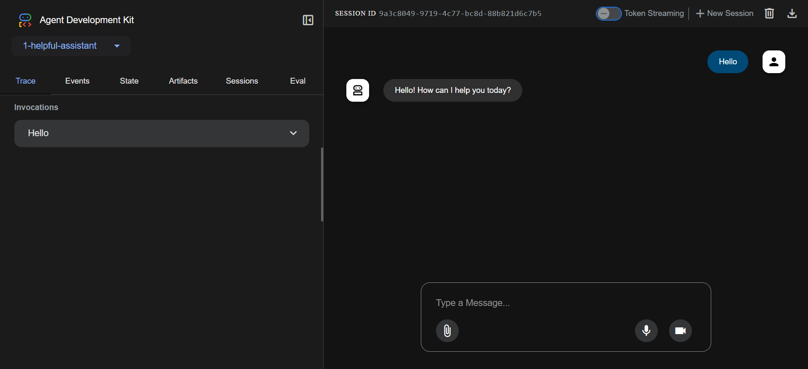

# Helpful Assistant

A simple yet powerful AI assistant built using Google's Agent Development Kit (ADK) and Gemini model. This assistant can help answer user questions using the Gemini 2.0 Flash model.



## Features

- Powered by Google's Gemini 2.0 Flash model
- Configurable to use either Vertex AI or Google GenAI API
- Simple and straightforward implementation
- Easy to extend and customize

## Prerequisites

- Python 3.7 or higher
- Google Cloud Project (for Vertex AI) or Google AI Studio API key
- Required Python packages (see `requirements.txt`)

## Installation

1. Clone the repository
2. Install the required dependencies:
   ```bash
   pip install -r requirements.txt
   ```
3. Copy the environment configuration file:
   ```bash
   cp .env.sample .env
   ```
4. Configure your environment variables in `.env`:
   - For Vertex AI:
     - Set `GOOGLE_GENAI_USE_VERTEXAI=1`
     - Configure your Google Cloud Project and region
   - For Google GenAI API:
     - Set `GOOGLE_GENAI_USE_VERTEXAI=FALSE`
     - Add your API key from Google AI Studio

## Usage

The agent is implemented in `agent.py` and can be imported and used in your Python applications:

```python
from helpful_assistant.agent import root_agent

# The agent will automatically use the configuration from your .env file
response = root_agent.invoke("Your question here")
```

## Project Structure

- `agent.py` - Main agent implementation
- `requirements.txt` - Project dependencies
- `.env.sample` - Template for environment configuration
- `__init__.py` - Package initialization

## Dependencies

- `google-adk` - Google's Agent Development Kit
- `google-cloud-aiplatform` - Google Cloud AI Platform library with ADK and agent engines support

## License

This project is licensed under the MIT License - see the LICENSE file for details.