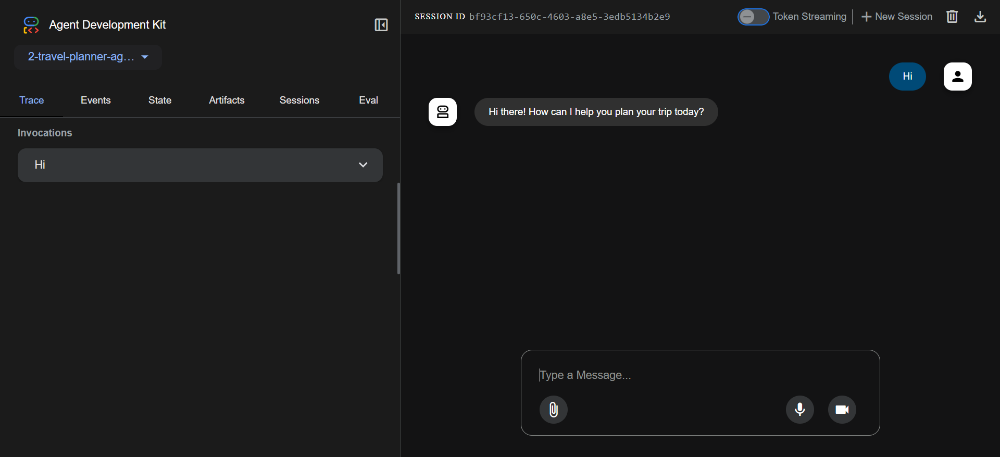

# Travel Planner Agent

An intelligent travel planning assistant built with Google's Agent Development Kit (ADK) and powered by the Gemini 2.0 Flash model. This agent helps users plan their trips by providing personalized travel recommendations and assistance.



## Features

- Interactive travel planning assistance
- Powered by Google's Gemini 2.0 Flash model
- Configurable to use either Vertex AI or Google GenAI API
- Natural conversation interface for travel-related queries
- Personalized travel recommendations

## Prerequisites

- Python 3.7 or higher
- Google Cloud Project (for Vertex AI) or Google AI Studio API key
- Required Python packages (see `requirements.txt`)

## Installation

1. Clone the repository
2. Install the required dependencies:
   ```bash
   pip install -r requirements.txt
   ```
3. Copy the environment configuration file:
   ```bash
   cp .env.sample .env
   ```
4. Configure your environment variables in `.env`:
   - For Vertex AI:
     - Set `GOOGLE_GENAI_USE_VERTEXAI=1`
     - Configure your Google Cloud Project, region, and storage bucket
   - For Google GenAI API:
     - Set `GOOGLE_GENAI_USE_VERTEXAI=FALSE`
     - Add your API key from Google AI Studio

The agent can assist with:
- Trip planning and itinerary creation
- Travel recommendations
- Destination information
- Activity suggestions
- Travel tips and advice

## Project Structure

- `agent.py` - Main travel planner agent implementation
- `requirements.txt` - Project dependencies
- `.env.sample` - Template for environment configuration
- `__init__.py` - Package initialization

## Dependencies

- `google-adk` - Google's Agent Development Kit
- `google-cloud-aiplatform` - Google Cloud AI Platform library with ADK and agent engines support

## Configuration

The agent can be configured using environment variables (see `.env.sample` for details):
- Vertex AI configuration (recommended for production)
- Google GenAI API configuration (simpler setup for development)

## License

This project is licensed under the MIT License - see the LICENSE file for details.
