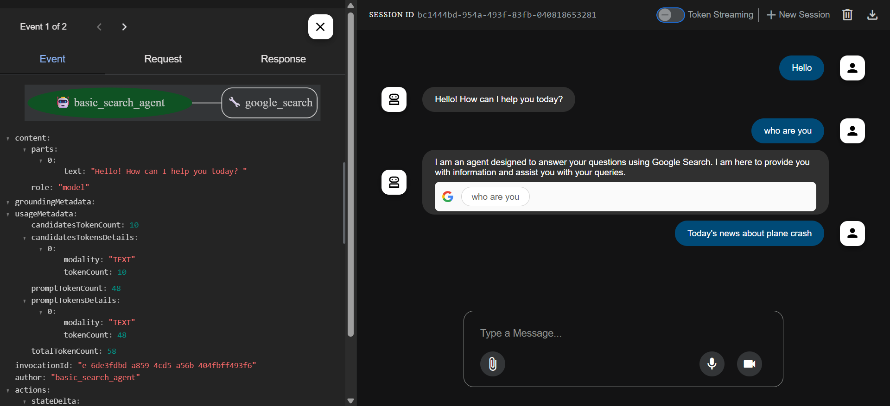

# Google Search Tool Agent

An intelligent agent built with Google's Agent Development Kit (ADK) that enhances conversations with real-time internet search capabilities using Google Search. This agent can answer questions by searching and synthesizing information from the web.



## Features

- Real-time Google Search integration
- Powered by Google's Gemini 2.0 Flash model
- Natural language query processing
- Up-to-date information from the internet
- Configurable to use either Vertex AI or Google GenAI API
- Simple and intuitive interface

## Prerequisites

- Python 3.7 or higher
- Google Cloud Project (for Vertex AI) or Google AI Studio API key
- Required Python packages (see `requirements.txt`)
- Google Search API access

## Installation

1. Clone the repository
2. Install the required dependencies:
   ```bash
   pip install -r requirements.txt
   ```
3. Copy the environment configuration file:
   ```bash
   cp .env.sample .env
   ```
4. Configure your environment variables in `.env`:
   - For Vertex AI:
     - Set `GOOGLE_GENAI_USE_VERTEXAI=1`
     - Configure your Google Cloud Project and region
   - For Google GenAI API:
     - Set `GOOGLE_GENAI_USE_VERTEXAI=FALSE`
     - Add your API key from Google AI Studio


The agent can:
- Search the internet for current information
- Answer questions with up-to-date data
- Provide real-time search results
- Synthesize information from multiple sources

## Project Structure

- `agent.py` - Main agent implementation with Google Search tool integration
- `requirements.txt` - Project dependencies
- `.env.sample` - Template for environment configuration
- `__init__.py` - Package initialization

## Dependencies

- `google-adk` - Google's Agent Development Kit
- `google-cloud-aiplatform` - Google Cloud AI Platform library with ADK and agent engines support

## How It Works

The agent uses the pre-built `google_search` tool from Google's ADK to perform real-time internet searches. When a user asks a question:

1. The agent processes the natural language query
2. Performs a Google search using the integrated tool
3. Synthesizes the search results
4. Returns a comprehensive answer

## Configuration

Two configuration options are available (see `.env.sample`):
1. Vertex AI (recommended for production)
2. Google GenAI API (simpler setup for development)

## License

This project is licensed under the MIT License - see the LICENSE file for details.
